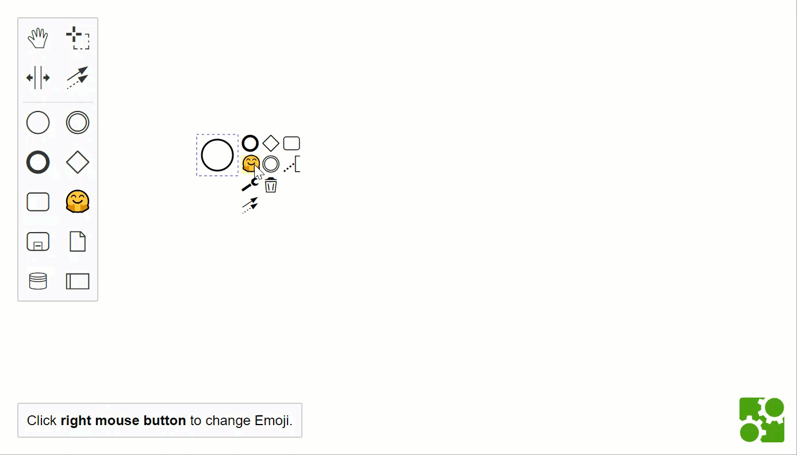

# Custom Elements in bpmn-js

An example of how to use a custom element while ensuring BPMN 2.0 compatibility.

 

## About

### Creating a Moddle Extension

The custom element is actually a task with a custom attribute that is defined in a [moddle extension](https://github.com/bpmn-io/moddle):

```javascript
{
  "name": "EmojiTask",
  "extends": [ "bpmn:Task" ],
  "properties": [
    {
      "name": "emoji",
      "isAttr": true,
      "type": "String"
    }
  ]
}
```

The XML of the custom element looks like this:

```xml
<bpmn:task id="Task_1" emojis:emoji="🤗" />
```

Still valid BPMN 2.0.

For more complex extensions you can use extension elements. The emoji could also be an extension element:

```javascript
{
  "name": "Emoji",
  "superClass": [ "Element" ],
  "properties": [
    {
      "name": "emoji",
      "isBody": true,
      "type": "String"
    }
  ]
}
```

The XML would look like this:

```xml
<bpmn:task id="Task_1">
  <bpmn:extensionElements>
    <emojis:emoji>🤗</emojis:emoji>
  </bpmn:extensionElements>
</bpmn:task>
```

### Rendering the Custom Element

In order to render the custom element an [additional renderer](https://github.com/philippfromme/bpmn-js-custom-elements-example/blob/master/app/modules/EmojiRenderer.js) is used. It knows which elements to render:

```javascript
EmojiRenderer.prototype.canRender = function(element) {
  if (!is(element, 'bpmn:Task')) {
    return;
  }

  var businessObject = getBusinessObject(element);

  return businessObject.emoji;
};
```

It also knows how to render them:

```javascript

EmojiRenderer.prototype.drawShape = function(parentNode, element) {
  var businessObject = element.businessObject,
      emoji = businessObject.emoji;

  var width = element.width,
      height = element.height;

  var rect = drawRect(parentNode, width, height, TASK_BORDER_RADIUS);

  svgAppend(parentNode, rect);

  var text = svgCreate('text');

  svgAttr(text, {
    x: 10,
    y: 25
  });

  svgClasses(text).add('djs-label');

  svgAppend(text, document.createTextNode(emoji));

  svgAppend(parentNode, text);

  return rect;
};
```

### Creating the Custom Element

The custom element can be created like any other element: using the palette or the context pad. Therefore, both are overridden:

The [palette](https://github.com/philippfromme/bpmn-js-custom-elements-example/blob/master/app/modules/EmojiPaletteProvider.js) contains an additional entry for creating the custom element:

```javascript

'create.emojiTask': {
  group: 'activity',
  className: 'icon-emoji',
  title: translate('Create Emoji Task'),
  action: {
    dragstart: createEmojiTask,
    click: createEmojiTask
  }
},
```

The [context pad](https://github.com/philippfromme/bpmn-js-custom-elements-example/blob/master/app/modules/EmojiContextPadProvider.js) contains an additional entry, too:

```javascript
'append.append-emoji-task': {
  group: 'model',
  className: 'icon-emoji',
  title: translate('Append Emoji Task'),
  action: {
    dragstart: appendEmojiTaskStart,
    click: appendEmojiTask
  }
},
```

## Run

```
npm i && npm run dev
```

## License

MIT